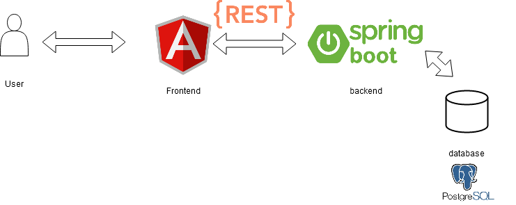

## Screenshot

## Description

The objective of this project is developing a simple e-commerce web application.

## Features

 - Select products by category
 - View the product details
 - Add a product to the cart
 - Manage cart
 - Search for products
 - Check out the product

## Architecture

## Technologies

Spring boot, Angular, Bootstrap, PostgresSQL

## Back end
https://github.com/aniskchaou/ECOMMERCE-BACKEND-SPRING